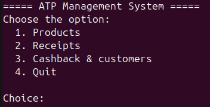

# ATP Management System

Навчальний проєкт призначений для керування магазином.

Наразі реалізовано:

- Створення, редагування та перегляд товарів

- Два види знижок: Regular, Bundle (aka -70% за кожен другий товар)

- Створення чеків з обрахунком вартості в процесі створення



## Build & run

### Підготовка

- Встановими CMake 3.16 або вище та будь-який компілятор C++ (aka GCC, clang, MSVC, etc)

- Встановити бібліотеки GTest, GMock

### Build

```bash
mkdir build
cd build
cmake ..
cmake --build .
```

### Запуск

```bash
./src/ATP
```

Запуск тестів:

```bash
./tests/ATP_test
```

## See also

[User guide](docs/USER_GUIDE.md)

[Developer guide](docs/DEVELOPER_GUIDE.md)

[Final report](docs/FINAL_REPORT.md)

[Testing](docs/TESTING.md)

[Vision](docs/vision.md)

[Test matrix](docs/test-matrix.md)

[Test strategy](docs/test-strategy.md)