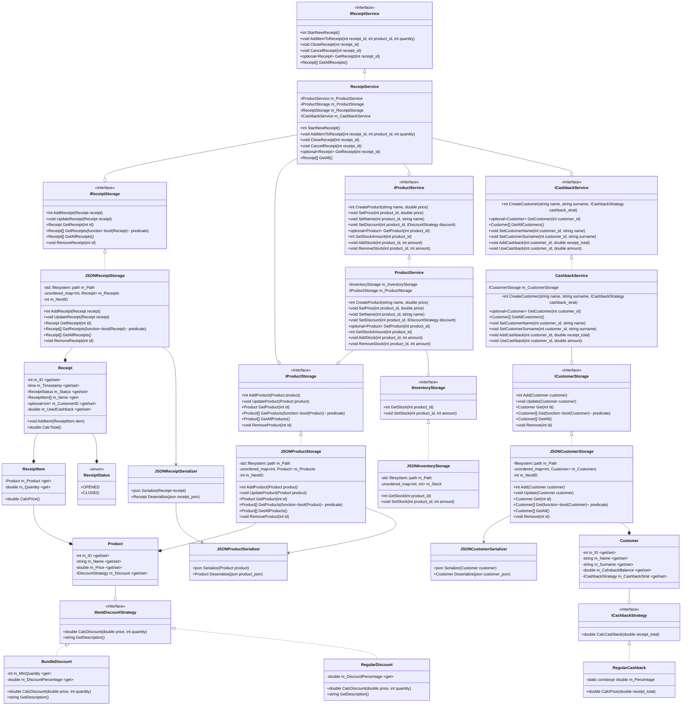

```mermaid
classDiagram
direction TB
    class Product {
	    -int m_ID ~get/set~
	    -string m_Name ~get/set~
	    -double m_Price ~get/set~
	    -IDiscountStrategy m_Discount ~get/set~
    }

    class ReceiptItem {
	    -Product m_Product ~get~
	    -double m_Quantity ~get~
	    +double CalcPrice()
    }

    class IProductStorage {
	    +int AddProduct(Product product)
	    +void UpdateProduct(Product product)
	    +Product GetProduct(int id)
	    +Product[] GetProducts(function~bool(Product)~ predicate)
	    +Product[] GetAllProducts()
	    +void RemoveProduct(int id)
    }

    class IReceiptStorage {
	    +int AddReceipt(Receipt receipt)
	    +void UpdateReceipt(Receipt receipt)
	    +Receipt GetReceipt(int id)
	    +Receipt[] GetReceipts(function~bool(Receipt)~ predicate)
	    +Receipt[] GetAllReceipts()
	    +void RemoveReceipt(int id)
    }

    class IItemDiscountStrategy {
	    +double CalcDiscount(double price, int quantity)
	    +string GetDescription()
    }

    class ReceiptStatus {
	    +OPENED
	    +CLOSED
    }

    class BundleDiscount {
	    -int m_MinQuantity ~get~
	    -double m_DiscountPercentage ~get~
	    +double CalcDiscount(double price, int quantity)
	    +string GetDescription()
    }

    class RegularDiscount {
	    -double m_DiscountPercentage ~get~
	    +double CalcDiscount(double price, int quantity)
	    +string GetDescription()
    }

    class JSONReceiptStorage {
	    -std::filesystem::path m_Path
	    -unordered_map~int, Receipt~ m_Receipts
	    -int m_NextID
	    +int AddReceipt(Receipt receipt)
	    +void UpdateReceipt(Receipt receipt)
	    +Receipt GetReceipt(int id)
	    +Receipt[] GetReceipts(function~bool(Receipt)~ predicate)
	    +Receipt[] GetAllReceipts()
	    +void RemoveReceipt(int id)
    }

    class JSONProductStorage {
	    -std::filesystem::path m_Path
	    -unordered_map~int, Product~ m_Products
	    -int m_NextID
	    +int AddProduct(Product product)
	    +void UpdateProduct(Product product)
	    +Product GetProduct(int id)
	    +Product[] GetProducts(function~bool(Product)~ predicate)
	    +Product[] GetAllProducts()
	    +void RemoveProduct(int id)
    }

    class JSONProductSerializer {
	    +json Serialize(Product product)
	    +Product Deserialize(json product_json)
    }

    class JSONReceiptSerializer {
	    +json Serialize(Receipt receipt)
	    +Receipt Deserialize(json receipt_json)
    }

    class IInventoryStorage {
	    +int GetStock(int product_id)
	    +void SetStock(int product_id, int amount)
    }

    class JSONInventoryStorage {
	    -std::filesystem::path m_Path
	    -unordered_map~int, int~ m_Stock
	    +int GetStock(int product_id)
	    +void SetStock(int product_id, int amount)
    }

    class IProductService {
	    +int CreateProduct(string name, double price)
	    +void SetPrice(int product_id, double price)
	    +void SetName(int product_id, string name)
	    +void SetDiscount(int product_id, IDiscountStrategy discount)
	    +optional~Product~ GetProduct(int product_id)
	    +int GetStockAmount(int product_id)
	    +void AddStock(int product_id, int amount)
	    +void RemoveStock(int product_id, int amount)
    }

    class ProductService {
	    -IInventoryStorage m_InventoryStorage
	    -IProductStorage m_ProductStorage
	    +int CreateProduct(string name, double price)
	    +void SetPrice(int product_id, double price)
	    +void SetName(int product_id, string name)
	    +void SetDiscount(int product_id, IDiscountStrategy discount)
	    +optional~Product~ GetProduct(int product_id)
	    +int GetStockAmount(int product_id)
	    +void AddStock(int product_id, int amount)
	    +void RemoveStock(int product_id, int amount)
    }

    class IReceiptService {
	    +int StartNewReceipt()
	    +void AddItemToReceipt(int receipt_id, int product_id, int quantity)
	    +void CloseReceipt(int receipt_id)
	    +void CancelReceipt(int receipt_id)
	    +optional~Receipt~ GetReceipt(int receipt_id)
	    +Receipt[] GetAllReceipts()
    }

    class ICashbackStrategy {
	    +double CalcCashback(double receipt_total)
    }

    class Customer {
	    -int m_ID ~get/set~
	    -string m_Name ~get/set~
	    -string m_Surname ~get/set~
	    -double m_CahsbackBalance ~get/set~
	    -ICashbackStrategy m_CashbackStrat ~get/set~
    }

    class ICustomerStorage {
	    +int Add(Customer customer)
	    +void Update(Customer customer)
	    +Customer Get(int id)
	    +Customer[] Get(function~bool(Customer)~ predicate)
	    +Customer[] GetAll()
	    +void Remove(int id)
    }

    class Receipt {
	    -int m_ID ~get/set~
	    -time m_Timestamp ~get/set~
	    -ReceiptStatus m_Status ~get/set~
	    -ReceiptItem[] m_Items ~get~
	    -optional~int~ m_CustomerID ~get/set~
	    -double m_UsedCashback ~get/set~
	    +void AddItem(ReceiptItem item)
	    +double CalcTotal()
    }

    class RegularCashback {
	    -static constexpr double m_Percentage
	    +double CalcPrice(double receipt_total)
    }

    class ICashbackService {
	    +int CreateCustomer(string name, string surname, ICashbackStrategy cashback_strat)
	    +optional~Customer~ GetCustomer(int customer_id)
	    +Customer[] GetAllCustomers()
	    +void SetCustomerName(int customer_id, string name)
	    +void SetCustomerSurname(int customer_id, string surname)
	    +void AddCashback(int customer_id, double receipt_total)
	    +void UseCashback(int customer_id, double amount)
    }

    class CashbackService {
	    ICustomerStorage m_CustomerStorage
	    +int CreateCustomer(string name, string surname, ICashbackStrategy cashback_strat)
	    +optional~Customer~ GetCustomer(int customer_id)
	    +Customer[] GetAllCustomers()
	    +void SetCustomerName(int customer_id, string name)
	    +void SetCustomerSurname(int customer_id, string surname)
	    +void AddCashback(int customer_id, double receipt_total)
	    +void UseCashback(int customer_id, double amount)
    }

    class JSONCustomerStorage {
	    -filesystem::path m_Path
	    -unordered_map~int, Customer~ m_Customers
	    -int m_NextID
	    +int Add(Customer customer)
	    +void Update(Customer customer)
	    +Customer Get(int id)
	    +Customer[] Get(function~bool(Customer)~ predicate)
	    +Customer[] GetAll()
	    +void Remove(int id)
    }

    class JSONCustomerSerializer {
	    +json Serialize(Customer customer)
	    +Customer Deserialize(json customer_json)
    }

    class ReceiptService {
	    -IProductService m_ProductService
	    -IProductStorage m_ProductStorage
	    -IReceiptStorage m_ReceiptStorage
	    -ICashbackService m_CashbackService
	    +int StartNewReceipt()
	    +void AddItemToReceipt(int receipt_id, int product_id, int quantity)
	    +void CloseReceipt(int receipt_id)
	    +void CancelReceipt(int receipt_id)
	    +optional~Receipt~ GetReceipt(int receipt_id)
	    +Receipt[] GetAll()
    }

	<<Interface>> IProductStorage
	<<Interface>> IReceiptStorage
	<<Interface>> IItemDiscountStrategy
	<<enum>> ReceiptStatus
	<<Interface>> IInventoryStorage
	<<Interface>> IProductService
	<<Interface>> IReceiptService
	<<Interface>> ICashbackStrategy
	<<Interface>> ICustomerStorage
	<<Interface>> ICashbackService

    ReceiptItem --* Product
    IItemDiscountStrategy <|.. BundleDiscount
    IItemDiscountStrategy <|.. RegularDiscount
    Receipt --* ReceiptItem
    ProductService --o IProductStorage
    ReceiptService --o IReceiptStorage
    Product --o IItemDiscountStrategy
    ReceiptService --o IProductStorage
    IProductStorage <|.. JSONProductStorage
    IReceiptStorage <|.. JSONReceiptStorage
    JSONProductStorage --* Product
    JSONReceiptStorage --* Receipt
    Receipt --* ReceiptStatus
    JSONReceiptSerializer --> JSONProductSerializer
    JSONReceiptStorage --> JSONReceiptSerializer
    JSONProductStorage --> JSONProductSerializer
    IInventoryStorage <|.. JSONInventoryStorage
    ProductService --o IInventoryStorage
    IProductService <|.. ProductService
    IReceiptService <|.. ReceiptService
    ReceiptService --o IProductService
    Customer --o ICashbackStrategy
    ICashbackStrategy <|.. RegularCashback
    ICashbackService <|.. CashbackService
    CashbackService --o ICustomerStorage
    ICustomerStorage <|.. JSONCustomerStorage
    JSONCustomerStorage --> JSONCustomerSerializer
    JSONCustomerStorage --* Customer
    ReceiptService --o ICashbackService
```