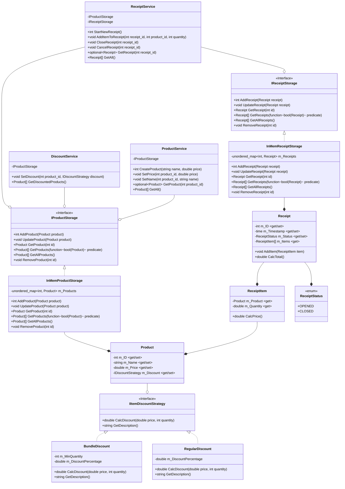

```mermaid
classDiagram
direction TB
   class DiscountService {
	    -IProductStorage
	    +void SetDiscount(int product_id, IDiscountStrategy discount)
	    +Product[] GetDiscountedProducts()
    }

    class Product {
	    -int m_ID ~get/set~
	    -string m_Name ~get/set~
	    -double m_Price ~get/set~
	    -IDiscountStrategy m_Discount ~get/set~
    }

    class ReceiptItem {
	    -Product m_Product ~get~
	    -double m_Quantity ~get~
	    +double CalcPrice()
    }

    class IProductStorage {
	    +int AddProduct(Product product)
	    +void UpdateProduct(Product product)
	    +Product GetProduct(int id)
	    +Product[] GetProducts(function~bool(Product)~ predicate)
	    +Product[] GetAllProducts()
	    +void RemoveProduct(int id)
    }

    class IReceiptStorage {
	    +int AddReceipt(Receipt receipt)
	    +void UpdateReceipt(Receipt receipt)
	    +Receipt GetReceipt(int id)
	    +Receipt[] GetReceipts(function~bool(Receipt)~ predicate)
	    +Receipt[] GetAllReceipts()
	    +void RemoveReceipt(int id)
    }

    class InMemProductStorage {
	    -unordered_map~int, Product~ m_Products
	    +int AddProduct(Product product)
	    +void UpdateProduct(Product product)
	    +Product GetProduct(int id)
	    +Product[] GetProducts(function~bool(Product)~ predicate)
	    +Product[] GetAllProducts()
	    +void RemoveProduct(int id)
    }

    class InMemReceiptStorage {
	    -unordered_map~int, Receipt~ m_Receipts
	    +int AddReceipt(Receipt receipt)
	    +void UpdateReceipt(Receipt receipt)
	    +Receipt GetReceipt(int id)
	    +Receipt[] GetReceipts(function~bool(Receipt)~ predicate)
	    +Receipt[] GetAllReceipts()
	    +void RemoveReceipt(int id)
    }

    class IItemDiscountStrategy {
	    +double CalcDiscount(double price, int quantity)
	    +string GetDescription()
    }

    class BundleDiscount {
	    -int m_MinQuantity
	    -double m_DiscountPercentage
	    +double CalcDiscount(double price, int quantity)
	    +string GetDescription()
    }

    class RegularDiscount {
	    -double m_DiscountPercentage
	    +double CalcDiscount(double price, int quantity)
	    +string GetDescription()
    }

    class Receipt {
	    -int m_ID ~get/set~
	    -time m_Timestamp ~get/set~
	    -ReceiptStatus m_Status ~get/set~
	    -ReceiptItem[] m_Items ~get~
	    +void AddItem(ReceiptItem item)
	    +double CalcTotal()
    }

    class ReceiptStatus {
	    +OPENED
	    +CLOSED
    }

    class ReceiptService {
	    -IProductStorage
	    -IReceiptStorage
	    +int StartNewReceipt()
	    +void AddItemToReceipt(int receipt_id, int product_id, int quantity)
	    +void CloseReceipt(int receipt_id)
	    +void CancelReceipt(int receipt_id)
	    +optional~Receipt~ GetReceipt(int receipt_id)
	    +Receipt[] GetAll()
    }

    class ProductService {
	    -IProductStorage
	    +int CreateProduct(string name, double price)
	    +void SetPrice(int product_id, double price)
	    +void SetName(int product_id, string name)
	    +optional~Product~ GetProduct(int product_id)
	    +Product[] GetAll()
    }

	<<Interface>> IProductStorage
	<<Interface>> IReceiptStorage
	<<Interface>> IItemDiscountStrategy
	<<enum>> ReceiptStatus

    ReceiptItem --* Product
    IItemDiscountStrategy <|.. BundleDiscount
    IItemDiscountStrategy <|.. RegularDiscount
    Receipt --* ReceiptItem
    ProductService --o IProductStorage
    DiscountService --o IProductStorage
    ReceiptService --o IReceiptStorage
    Product --o IItemDiscountStrategy
    ReceiptService --o IProductStorage
    IProductStorage <|.. InMemProductStorage
    IReceiptStorage <|.. InMemReceiptStorage
    InMemProductStorage --* Product
    InMemReceiptStorage --* Receipt
    Receipt --* ReceiptStatus
```